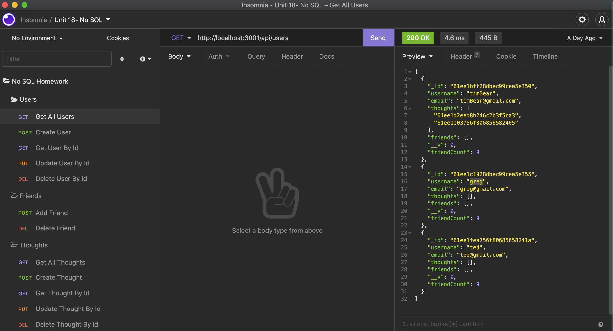

# NoSQL Social Network API

  ## Description
  This application creates a mock Social Network API that contains reactions, thoughts and users. It also utilizes CRUD operations, virtuals, populating references and more. This application uses Node, Mongoose, MongoDB and Express.

  ## Table of Contents

  * [Installation](#installation)

  * [Usage](#usage)

  * [Visuals](#visuals)

  * [Deployed Links](#deployed-links)

  * [Questions](#questions)


  ## Installation

  To install necessary dependencies, run the following command:

  ```npm start```

  ## Usage

  This DB is not hosted. Run ``` npm start ```. You must create your own seed data.

## Visuals
  

## Deployed Links

* [Demo Video](https://watch.screencastify.com/v/f7LVUXWYmQbn6hXOrmiu)

* [The URL of the GitHub repository.](https://github.com/simone188535/NoSQL-Social-Network-API)
  ## Questions

  If you have any questions about the repo, open
  an issue or contact me directly at simone.anthony1@yahoo.com. You
  can find more of me at [simone188535](https://github.com/simone188535)
